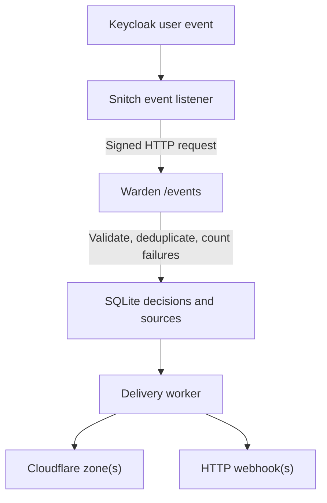
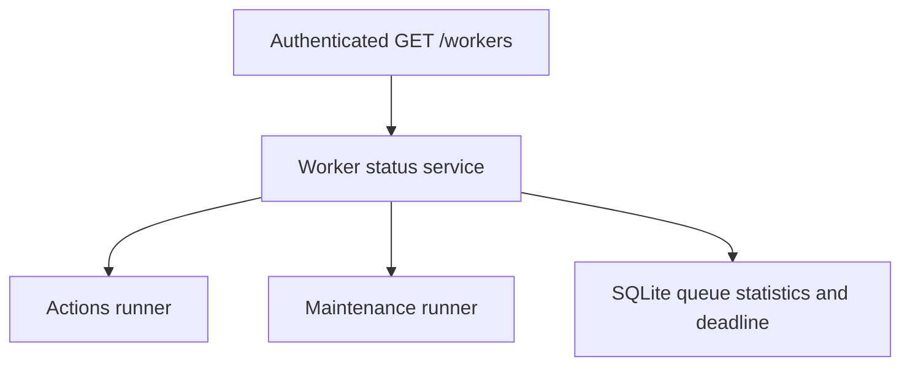

# Architecture

Warden has a small pipeline: **event ingestion → detection → durable desired state → independent delivery**.

```mermaid
flowchart TD
    A["Keycloak user event"]
    B["Snitch event listener"]
    C["Warden /events"]
    D["SQLite decisions and sources"]
    E["Delivery worker"]
    F["Cloudflare zone(s)"]
    G["HTTP webhook(s)"]

    A --> B
    B -->|"Signed HTTP request"| C
    C -->|"Validate, deduplicate, count failures"| D
    D --> E
    E --> F
    E --> G

```

## Ingestion and detection

Keycloak Snitch sends signed event envelopes to the application listener. Warden validates the event contract, normalizes the client IP, and processes matching Keycloak `LOGIN_ERROR` events. The rule counts distinct failures within the configured sliding window, keyed by **IP address**, not by user or realm.

When the threshold is reached, Warden records or extends a decision in SQLite. Duplicate events do not cause duplicate observations.

Detection policy stays in the ingestion service. Runtime targets own their provider settings and retry limits; ingestion, ban administration, and the delivery worker pass the necessary destination identifiers to SQLite operations when creating or reconciling decisions. The store does not retain detection rules or target configuration.

## Desired versus delivered state

An append-only source mutation journal records persisted additions, changes and removals independently of decision revisions; source-only edits do not trigger outbound reconciliation. These records start with the source journal migration and are bounded on individual inspection.

A decision's `state` is either `banned` or `unbanned`. Both the internal application and public Go client use `pkg/decisionstate.State` for this desired state; JSON and YAML still encode it as the same string. This is **Warden's desired state**, not proof that an external system has already applied it. Each destination acknowledges revisions independently, and unsuccessful deliveries are retried.

SQLite persists the same `banned` and `unbanned` values in the constrained `decisions.state` column. It does not maintain a separate boolean representation of desired state.

Automatic expiry or a manual unban changes the desired state to `unbanned`. A manual ban and an automatic ban are independent sources; releasing an IP removes the active reasons for blocking it.

Maintenance computes the observation retention cutoff from the detection window (at least 24 hours) and supplies that cutoff directly to SQLite. Only delivery state and destination identifiers needed to resume delivery are persisted.

The administrative API, `list-active`, and `inspect` return the same record shape: `decision`, `sources`, and `deliveries`. `sources` describes the independent currently active automatic or manual reasons for a block, while `deliveries` contains the last acknowledged revision for each destination. A released decision retains its historical identity and delivery acknowledgements, but has no active sources.

A webhook receives only the desired decision (`id`, `revision`, `ipAddress`, `state`, and `expiresAt`). Failure observations are retained internally for detection and replay protection, not exported as part of the decision.

## Two listeners

The application listener serves `POST /events` and, when an admin token is configured, authenticated `/bans` routes. The independent management listener serves `/healthz`, `/readyz`, and optionally `/metrics`.

`--route-prefix` applies to the application routes. Management paths stay at their root paths.

See [API](api.md) for the endpoints and [Operations](operations.md) for maintenance and readiness behavior.

## Ban reconciliation ownership

The `bans` application package evaluates source extension and effective decision revisions. SQLite exposes transactional read/write primitives and synchronizes persisted delivery rows without interpreting ban policy.

## Worker observability

The two existing background goroutines remain independent: the action worker handles ban expiry, destination delivery and retries, while the maintenance worker handles scheduled database pruning and optimization. Each runner exposes one concurrency-safe `Snapshot()` method. The maintenance snapshot also backs `GET /maintenance`; action queue statistics and deadlines remain in SQLite, not in the runner. The authenticated `GET /workers` endpoint aggregates these read-only snapshots with SQLite-backed queue counts and deadlines. It does **not** create a registry or another worker, and it never changes a decision or schedule.

```mermaid
flowchart TD
    UI["Authenticated GET /workers"] --> S["Worker status service"]
    S --> A["Actions runner"]
    S --> M["Maintenance runner"]
    S --> DB["SQLite queue statistics and deadline"]
```

## Delivery retry backoff

The `actions` package calculates the capped exponential retry delay (10 seconds up to 5 minutes) using the destination's last persisted delay. SQLite only loads the previous delay and atomically stores the calculated pause and retry deadline along with the attempt result.

## Expiry and release workflows

`bans` orchestrates manual releases and source expiry using atomic `TransactDecision` callbacks. The application clears sources, advances the observation generation, computes effective decisions and enqueues delivery revisions; SQLite provides only the corresponding persistence primitives. The action worker delegates expiry to `bans.ExpiryService`, rather than asking SQLite to maintain ban policy.

## Policy and persistence boundaries

At startup, SQLite reports the destinations that still own bans or unacknowledged revisions; `actions.ValidateTargets` decides whether the configured target set is safe. The application owns the delivery attempt-limit decision (`actions.StatusAfterFailure`), while SQLite counts recorded attempts and applies status updates transactionally. The administrative history API returns bounded, numbered-page snapshots using SQLite LIMIT/OFFSET; all attempts remain durably stored, including successful responses that arrive after a newer revision supersedes an in-flight attempt. Such stale completions never advance current acknowledgements or backoff state.

## Decision revision audit trail

Warden appends an immutable revision snapshot whenever the effective desired decision changes. The journal captures the commit time, workflow cause, requested state, expiry, and active source reasons. This write shares the original decision transaction, so an unsuccessful transaction cannot leave behind a misleading history entry. Historic revisions prior to migration 0008 cannot be reconstructed from the current decision row.

The authenticated `/decisions/history` query reads this journal. `/deliveries` instead reads the current revision from existing delivery tables, including release attempts, without creating a separate delivery store or service process.
